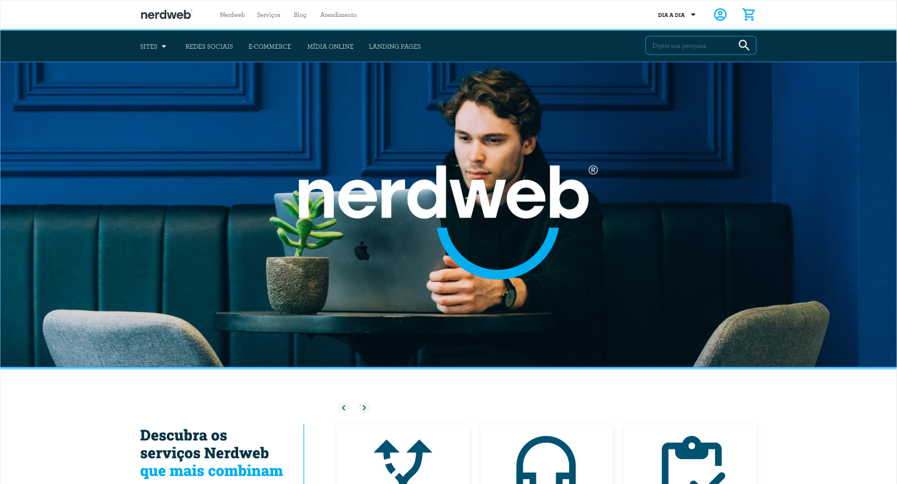

# TESTE PRÁTICO FRONT-END

<code > 🚧 Projeto em Desenvolvimento 🚧 </code>

 

 

## Proposta do Teste

---

A proposta desse teste é validar os conhecimentos técnicos em desenvolvimento front-end, como a capacidade de replicar o layout com qualidade e também a de tomar decisões criativas para deixar a interface com a maior qualidade possível.
<strong style="display: block">Os mínimos detalhes vão valer muito!</strong>

 

## Tecnologias Utilizadas

---

- <strong>Estrutura:</strong> HTML
- <strong>Linguagem:</strong> JavaScript
- <strong>Estilização:</strong> SASS (Sintaxe: SCSS)
- <strong>Iconografia:</strong> FontAwesome
- <strong>Carrossel:</strong> Swiper.js

 

## Critérios de Avaliação

---

- <strong>Responsividade</strong>
- <strong>Qualidade Visual</strong>
- <strong>Qualidade de Código</strong>

 

## Layout

---

<a href="https://xd.adobe.com/view/f9b036e6-b5a6-4819-a6c5-4df3b33b8098-ace3/specs/">Clique aqui para acessar ao layout disponibilizado</a>

 

## Sobre o Desenvolvedor

---

<pre>
{
    nome: "Ícaro Bomfim Teles", 
    idade: 19, 
    github: <a href="http://www.github.com/icarobteles">icarobteles/github</a>,
    linkedin: <a href="http://www.linkedin.com/in/icarobteles">icarobteles/linkedin</a>,
    habilidades: [
        "HTML", 
        "CSS", 
        "SASS", 
        "Styled-Components",
        "JavaScript", 
        "TypeScript", 
        "React", 
        "Next", 
        "Node", 
        "Express", 
        "JsonWebToken",
        "Postgresql", 
        "MongoDB", 
        "TypeORM", 
        "Redis",
        "Jest",
        "React Testing Library",
        "Figma",
        "Git",
        "GitHub"
    ]
}
</pre>
